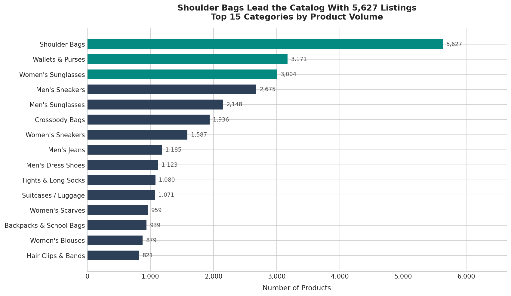
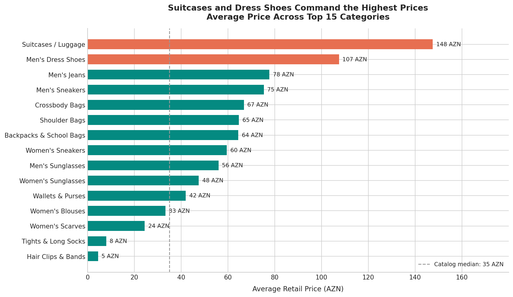
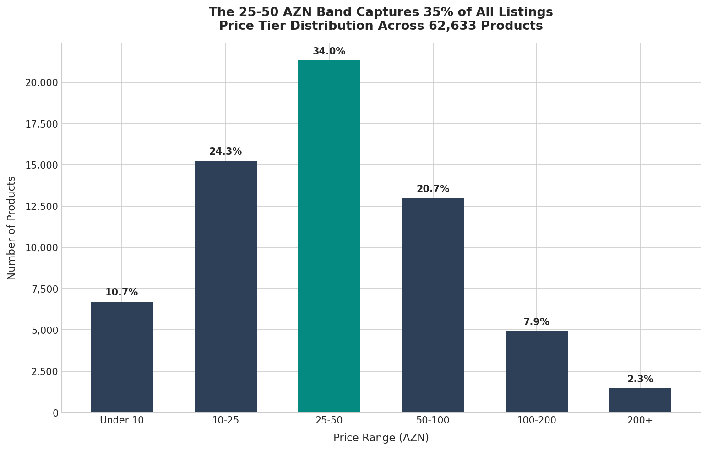
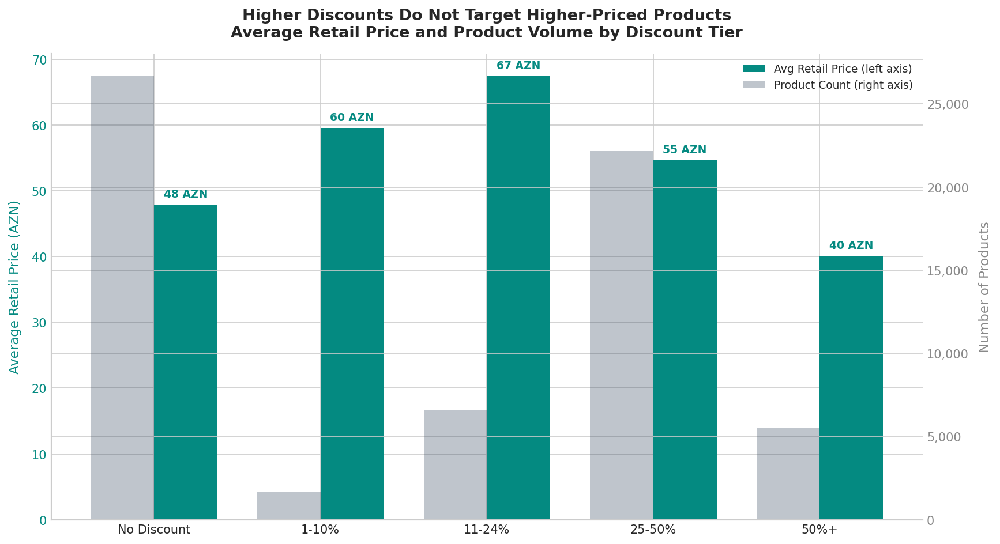
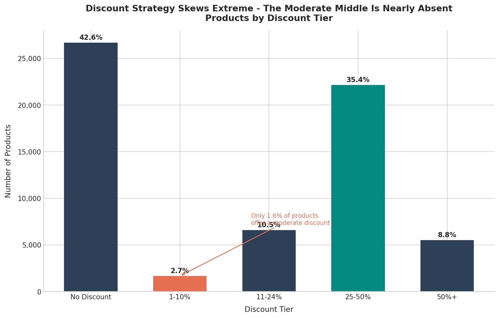
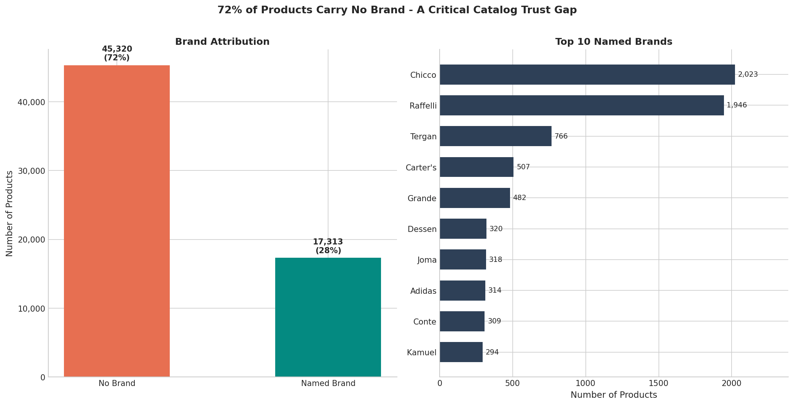
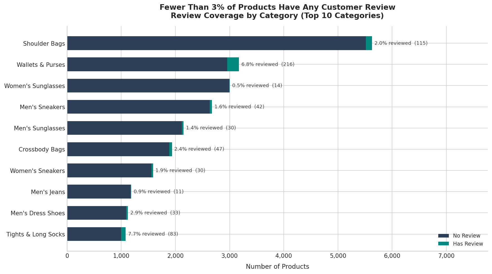
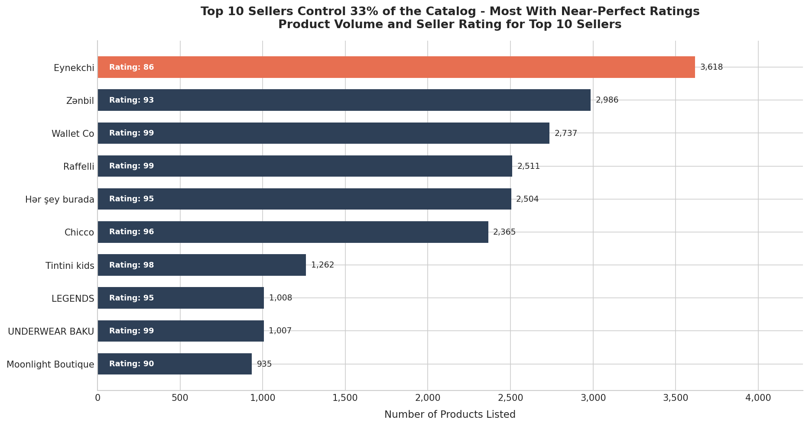
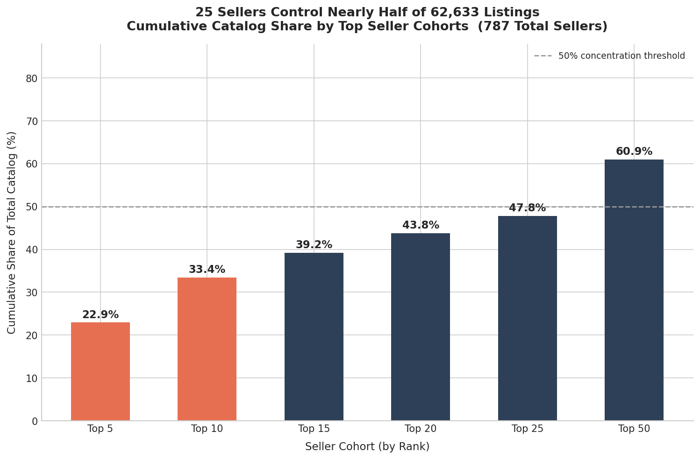
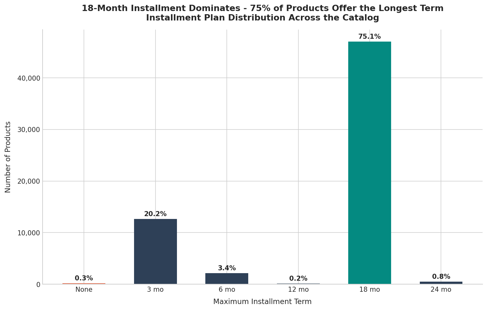

# Umico.az Clothing Marketplace — Business Analytics Report

- > **Audience:** Executives, Product Owners, Business Managers
- > **Catalog scope:** Clothing & Accessories — 62,633 active listings, 787 sellers, 345 categories
- > **Period:** February 2026

---

## Executive Summary

The umico.az clothing and accessories marketplace lists 62,633 products spanning bags, footwear, eyewear, and apparel — with shoulder bags, wallets, and sunglasses forming the three largest category clusters. The catalog is heavily concentrated in the affordable 25–50 AZN price band, and nearly all sellers offer 18-month installment financing, positioning the platform as accessible by design. Two structural vulnerabilities stand out: **72% of products carry no brand identity**, and **fewer than 3% of listings have a single customer review**, leaving buyers with almost no trust signals beyond price and photographs. Discount behavior is sharply polarized — sellers either offer nothing or cut prices by 25% or more, with almost no mid-tier promotional activity — which risks eroding consumer trust in the platform's pricing credibility. Seller power is concentrated: just 25 sellers account for nearly half of all listings, making platform health highly dependent on a small group of power partners.

---

## 1. What the Catalog Sells — And What It's Worth

**What these charts show:**
The first chart ranks the 15 largest product categories by listing count. The second maps those same categories to their average retail price.

**Why it matters:**
Volume and price together reveal where the real commercial opportunity sits. Shoulder Bags lead with 5,627 listings at an average of 65 AZN — a high-volume, mid-value category. Wallets and Women's Sunglasses follow with 3,000+ listings each. At the other extreme, Suitcases (1,071 listings) carry the highest average price in the top 15 at 148 AZN, and Men's Dress Shoes average 107 AZN — both dramatically under-represented relative to their revenue potential.

Meanwhile, Tights & Long Socks (1,080 listings, avg 8 AZN) and Hair Clips & Bands (821 listings, avg 4.50 AZN) drive significant catalog depth but minimal revenue per transaction. These categories likely serve as traffic drivers rather than revenue generators.

**Decisions this informs:**
- **Prioritize accessories merchandising** — Bags, wallets, and sunglasses together represent nearly 12,000 listings and solid average prices. These categories deserve premium placement, dedicated campaigns, and enhanced filtering.
- **Targeted seller acquisition in premium segments** — Suitcases and Dress Shoes are under-stocked relative to their price points. Recruiting 10–15 strong sellers in these categories could meaningfully increase platform GMV without adding catalog volume.
- **Rationalize low-value, high-volume categories** — Tights and Hair Clips may need bundling or minimum order strategies to make them commercially viable for both sellers and the platform.

---

## 2. Where the Market Lives — Price Architecture and Discounting Logic

**What these charts show:**
The price architecture chart segments all 62,633 listings into six price bands. The second chart overlays the average retail price and total product volume for each discount tier side by side.

**Why it matters:**
More than half the catalog sits below 50 AZN — the 25–50 AZN band alone captures 35% of all listings. The 10–25 AZN and 50–100 AZN bands each hold roughly 22%, creating a broad mid-market core. Premium listings (100 AZN and above) account for just 10% of the catalog.

The discount-price chart reveals a counterintuitive pattern: products with moderate discounts (11–24%) actually carry the **highest average retail prices**, not the zero-discount tier. This suggests sellers in mid-range price brackets use discounting strategically as a positioning signal — not simply as a clearance tool. Products with the deepest discounts (50%+) tend to cluster at lower original price points, implying clearance activity in the budget segment.

**Decisions this informs:**
- **The 25–50 AZN window is saturated** — new sellers entering this range face the most competition. Category managers should guide new seller onboarding toward underserved price points.
- **The premium segment (100–200 AZN) is a growth opportunity** — at only 8% of the catalog, it has headroom. Premium curation programs with verified brands and enhanced product pages could differentiate this tier.
- **Investigate inflated original prices at 50%+ discount** — when the deepest discounts attach to the cheapest products, it signals potential price inflation. Platform policy should require original prices to reflect genuine prior sales, not artificial anchors.

---

## 3. The Discount Problem — Polarized Strategy, Missing Middle

**What this chart shows:**
The full breakdown of discount behavior across the catalog: the share of products offering no discount, light discounts (1–24%), heavy discounts (25–50%), and extreme discounts (50%+).

**Why it matters:**
A healthy promotional ecosystem distributes discounts smoothly across a range — giving buyers a sense of consistent, credible savings opportunities. What this platform shows instead is a stark binary: **43% of products offer no discount at all**, while **44% offer discounts of 25% or more**. The moderate 1–10% band — where most everyday promotional pricing lives — contains barely 1,000 products out of 62,633.

This polarization creates two risks. First, buyers may become skeptical of large discounts if they never see small, believable ones. Second, the absence of moderate discounting means sellers have no low-effort promotional lever — they either do nothing or run a deep cut.

**Decisions this informs:**
- **Introduce a "Deals" promotional mechanic for 5–20% discounts** — if the platform surfaces and rewards moderate discounting (e.g., via a dedicated "On Sale" filter or badge), sellers will have an incentive to use it.
- **Audit extreme discounts for price authenticity** — products marked 50%+ off should be reviewed for inflated original prices. An automated check comparing listed original prices against historical transaction data would reduce credibility risk.
- **Seller education** — many sellers may not realize that even a 5–15% discount can meaningfully lift click-through rates. A "How to Promote" guide in the seller portal could shift behavior without requiring platform-level incentives.

---

## 4. The Trust Gap — Missing Brands and Missing Reviews

**What these charts show:**
The brand attribution chart shows the split between products with a recognized brand name and those listed as "No Brand." The right panel ranks the top 10 named brands by listing count. The review coverage chart shows how few products in each top category carry any customer review.

**Why it matters:**
Brand identity and peer reviews are the two primary trust signals buyers use when shopping online. On this platform, both are nearly absent. **Seven in ten products have no brand**, and even among the top named brands, the leaders are mid-market: Chicco (2,023 listings), Raffelli (1,946), and Tergan (766). Global brands with broad consumer recognition — Adidas, Pierre Cardin — are present but marginal.

The review picture is even starker. Across every top category, **fewer than 3% of products carry a single customer review**. In Women's Sunglasses — the third-largest category — reviewed products account for under 1% of listings. With no brand trust and no peer validation, the buyer's decision rests almost entirely on price and the product photo.

**Decisions this informs:**
- **Launch a Brand Registry program** — require sellers to register verified brand names as a condition of catalog listings. Even converting 20% of unbranded products to registered names would create 9,000+ newly identifiable listings.
- **Make post-purchase review prompts mandatory** — a single well-timed email or push notification after delivery can multiply review rates. Other platforms see 5–15x increases from this alone.
- **Investigate review authenticity** — of the 1,579 products that have any rating, 74% show a perfect 5.0 stars. That distribution is statistically unusual and suggests either very limited review volume (making each review disproportionately influential) or review quality issues. A verified-purchase gate on reviews would protect credibility.
- **Consider a "Top Seller" badge system** — Wallet Co (rating 99), Raffelli (rating 99), and Tintini Kids (rating 98) have exceptional seller ratings. Surfacing these sellers prominently can substitute partially for missing brand signals.

---

## 5. Seller Power — Concentration and Quality

**What these charts show:**
The top sellers chart ranks the 10 largest sellers by listing count and annotates each with their seller rating. The concentration chart shows what percentage of the total catalog is controlled by progressively larger seller cohorts.

**Why it matters:**
The catalog is highly concentrated. The **top 5 sellers alone control 22% of all listings**. The top 25 control nearly half. Of the 787 sellers on the platform, the bottom 762 collectively share just over half the catalog. This is a meaningful operational risk: if any one of the top 10 sellers reduces their inventory or exits the platform, the catalog shrinks noticeably.

On the positive side, Chart 06 shows that most top sellers maintain very high ratings — Wallet Co, Raffelli, UNDERWEAR BAKU, and Tintini Kids all sit at 98–99. The one exception is Eynekchi (rating: 86), the largest seller by volume with 3,618 listings, which carries a notably lower quality score than its peers.

**Decisions this informs:**
- **Introduce seller concentration risk limits** — no single seller should exceed 6% of total catalog share as a platform policy target. This reduces dependency risk and encourages seller diversification programs.
- **Address the Eynekchi quality gap** — as the platform's largest seller, Eynekchi's below-average rating (86 vs. 95+ for most top sellers) represents both a buyer experience risk and a platform trust issue. A dedicated account management engagement to improve fulfillment, descriptions, or returns handling would have outsized impact.
- **Create a "Power Seller" certification tier** — sellers with 95+ ratings and 500+ listings should receive featured placement in search and category pages, reinforcing the link between quality and visibility.
- **Launch a long-tail seller development program** — the 777 sellers outside the top 10 collectively hold two-thirds of the catalog but remain largely invisible to buyers. Better discoverability tools, onboarding support, and promotional slots for emerging sellers would reduce concentration risk over time.

---

## 6. Financing as Infrastructure — The 18-Month Standard

**What this chart shows:**
The distribution of maximum installment plan lengths offered across all catalog listings.

**Why it matters:**
Installment financing is not a differentiator on this platform — it is table stakes. **75% of all products offer the maximum available term of 18 months**, and only 0.3% of listings have no installment option. Sellers are not using financing terms as a competitive signal; they are defaulting to the longest available option uniformly.

This uniformity has a practical consequence: buyers cannot use installment terms to comparison-shop, because nearly every product offers the same condition. The financing feature functions as a price accessibility mechanism rather than a value-add.

**Decisions this informs:**
- **Extend the maximum installment term to 24 months** — for premium categories (Luggage at 148 AZN, Dress Shoes at 107 AZN), monthly payments at 18 months are already accessible, but a 24-month option could expand the addressable buyer pool for the most expensive items.
- **Use shorter installment terms as a seller differentiation signal** — sellers offering 3-month terms on fast-moving, low-cost items (Tights, Hair Clips) could be surfaced with a "Quick Pay" badge to attract buyers who prefer shorter financial commitments.
- **Explore "Buy Now, Pay in 2" for sub-25 AZN products** — the 33% of listings priced under 25 AZN may not need 18-month installments. Introducing a lighter two-payment option for budget items could reduce financing complexity and processing cost.

---

## Strategic Recommendations

### Immediate Actions (0–90 Days)

| Priority | Action | Expected Impact |
|---|---|---|
| 1 | Launch post-purchase review prompt for all completed orders | Increase review coverage from 3% toward 15–20%; improve buyer trust |
| 2 | Audit and flag products with 50%+ discounts for price authenticity | Protect platform credibility; reduce buyer skepticism |
| 3 | Engage Eynekchi (largest seller, rating 86) in quality improvement program | Reduce buyer risk from the catalog's highest-volume seller |
| 4 | Introduce a verified Brand Registry for seller onboarding | Begin converting 72% unbranded products into identifiable listings |

### Medium-Term Initiatives (3–12 Months)

| Priority | Action | Expected Impact |
|---|---|---|
| 5 | Build a "Power Seller" certification and featured placement program | Reward quality; reduce long-tail seller invisibility |
| 6 | Design a moderate-discount promotional mechanic (5–20% band) | Fill the missing middle; increase seller use of gradual promotions |
| 7 | Run targeted seller recruitment campaigns for Luggage and Dress Shoes | Grow the high-value, under-represented premium segment |
| 8 | Test 24-month installment terms for products priced above 100 AZN | Expand premium category accessibility |

### Strategic Investments (12+ Months)

| Priority | Action | Expected Impact |
|---|---|---|
| 9 | Build a seller concentration risk monitoring dashboard | Early warning system for top-seller churn risk |
| 10 | Launch a long-tail seller development program with onboarding support | Reduce platform dependency on 25 power sellers |
| 11 | Develop premium category curation with brand and review requirements | Create a defensible premium segment above 100 AZN |
| 12 | Explore a "Verified Purchase" gate for customer reviews | Ensure review authenticity as coverage grows |

---

## Data Reference

| Field | Value |
|---|---|
| Data source | umico.az / birmarket.az marketplace API |
| Category scope | Clothing & Accessories (category ID 3003) |
| Total products analyzed | 62,633 active listings |
| Total sellers | 787 |
| Total categories | 345 |
| Data collected | February 2026 |
| Report prepared | February 2026 |

---

*This report was prepared from marketplace listing data and reflects the state of the catalog at the time of collection. It does not include transaction volumes, revenue figures, or customer behavioral data.*
